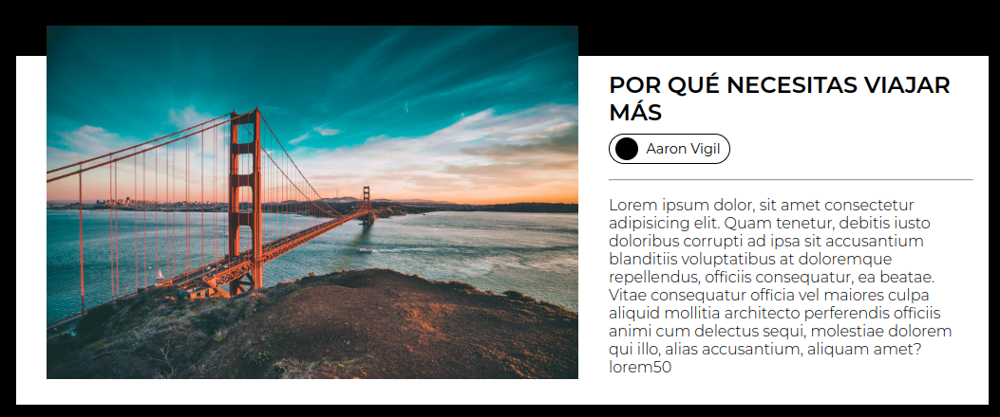
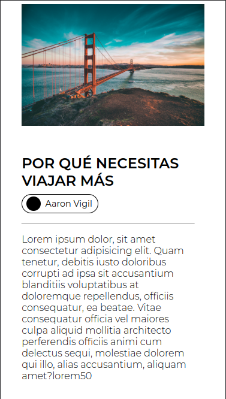

<h1>Una tarjeta infografica</h1>

El responsive y el estilo no me gustan demasiado pero lo útilice principalmente para practicar el <strong>position</strong> de CSS

Adjunto dos imagenes que muestran el <strong>Desktop</strong> y el <strong>Mobile</strong>

